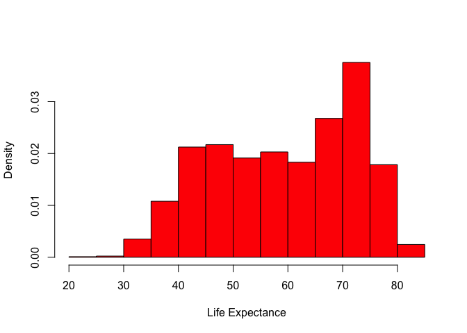
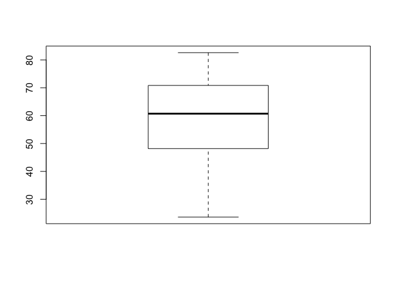
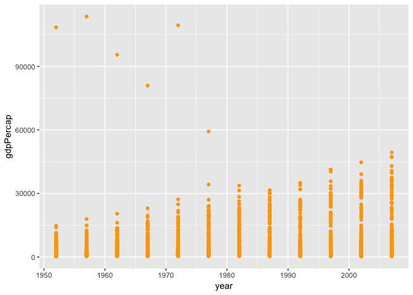
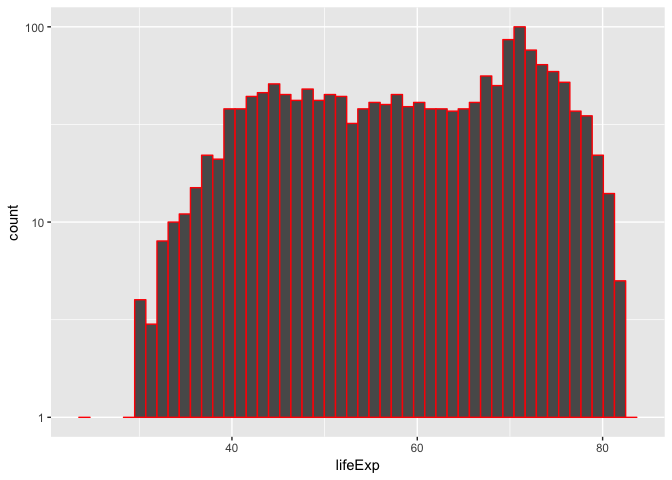
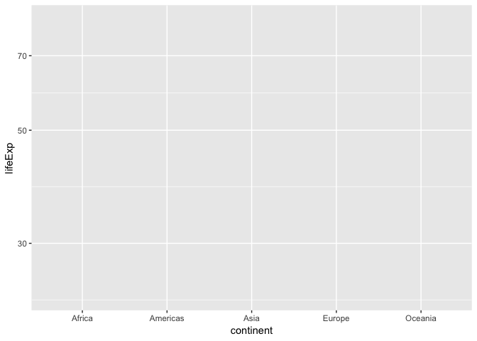
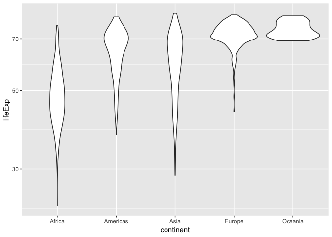

```r
library(gapminder)
```

```
## Warning: package 'gapminder' was built under R version 3.3.2
```

```r
gapminder
```

```
## # A tibble: 1,704 x 6
##    country     continent  year lifeExp      pop gdpPercap
##    <fct>       <fct>     <int>   <dbl>    <int>     <dbl>
##  1 Afghanistan Asia       1952    28.8  8425333      779.
##  2 Afghanistan Asia       1957    30.3  9240934      821.
##  3 Afghanistan Asia       1962    32.0 10267083      853.
##  4 Afghanistan Asia       1967    34.0 11537966      836.
##  5 Afghanistan Asia       1972    36.1 13079460      740.
##  6 Afghanistan Asia       1977    38.4 14880372      786.
##  7 Afghanistan Asia       1982    39.9 12881816      978.
##  8 Afghanistan Asia       1987    40.8 13867957      852.
##  9 Afghanistan Asia       1992    41.7 16317921      649.
## 10 Afghanistan Asia       1997    41.8 22227415      635.
## # ... with 1,694 more rows
```

```r
attach(gapminder)
```

##Information dense summary of tbl data. 


```r
##Information dense summary of tbl data. 

dplyr::glimpse(gapminder)
```

```
## Observations: 1,704
## Variables: 6
## $ country   <fct> Afghanistan, Afghanistan, Afghanistan, Afghanistan, ...
## $ continent <fct> Asia, Asia, Asia, Asia, Asia, Asia, Asia, Asia, Asia...
## $ year      <int> 1952, 1957, 1962, 1967, 1972, 1977, 1982, 1987, 1992...
## $ lifeExp   <dbl> 28.801, 30.332, 31.997, 34.020, 36.088, 38.438, 39.8...
## $ pop       <int> 8425333, 9240934, 10267083, 11537966, 13079460, 1488...
## $ gdpPercap <dbl> 779.4453, 820.8530, 853.1007, 836.1971, 739.9811, 78...
```


```r
summary(gapminder)
```

```
##         country        continent        year         lifeExp     
##  Afghanistan:  12   Africa  :624   Min.   :1952   Min.   :23.60  
##  Albania    :  12   Americas:300   1st Qu.:1966   1st Qu.:48.20  
##  Algeria    :  12   Asia    :396   Median :1980   Median :60.71  
##  Angola     :  12   Europe  :360   Mean   :1980   Mean   :59.47  
##  Argentina  :  12   Oceania : 24   3rd Qu.:1993   3rd Qu.:70.85  
##  Australia  :  12                  Max.   :2007   Max.   :82.60  
##  (Other)    :1632                                                
##       pop              gdpPercap       
##  Min.   :6.001e+04   Min.   :   241.2  
##  1st Qu.:2.794e+06   1st Qu.:  1202.1  
##  Median :7.024e+06   Median :  3531.8  
##  Mean   :2.960e+07   Mean   :  7215.3  
##  3rd Qu.:1.959e+07   3rd Qu.:  9325.5  
##  Max.   :1.319e+09   Max.   :113523.1  
## 
```

```r
##Is it a data.frame, a matrix, a vector, a list?

str(gapminder)
```

```
## Classes 'tbl_df', 'tbl' and 'data.frame':	1704 obs. of  6 variables:
##  $ country  : Factor w/ 142 levels "Afghanistan",..: 1 1 1 1 1 1 1 1 1 1 ...
##  $ continent: Factor w/ 5 levels "Africa","Americas",..: 3 3 3 3 3 3 3 3 3 3 ...
##  $ year     : int  1952 1957 1962 1967 1972 1977 1982 1987 1992 1997 ...
##  $ lifeExp  : num  28.8 30.3 32 34 36.1 ...
##  $ pop      : int  8425333 9240934 10267083 11537966 13079460 14880372 12881816 13867957 16317921 22227415 ...
##  $ gdpPercap: num  779 821 853 836 740 ...
```


```r
##What is its class?
class(gapminder)
```

```
## [1] "tbl_df"     "tbl"        "data.frame"
```


```r
##How many variables/columns?
ncol(gapminder)
```

```
## [1] 6
```


```r
##How many rows/observations?
nrow(gapminder)
```

```
## [1] 1704
```


```r
##Can you get these facts about “extent” or “size” in more than one way? 
dim(gapminder)
```

```
## [1] 1704    6
```

```r
length(pop)
```

```
## [1] 1704
```

```r
length(lifeExp)
```

```
## [1] 1704
```


```r
##What data type is each variable?
names(gapminder)
```

```
## [1] "country"   "continent" "year"      "lifeExp"   "pop"       "gdpPercap"
```

```r
typeof(country)
```

```
## [1] "integer"
```

```r
class(country)
```

```
## [1] "factor"
```

```r
typeof(pop)
```

```
## [1] "integer"
```

```r
class(pop)
```

```
## [1] "integer"
```

```r
typeof(lifeExp)
```

```
## [1] "double"
```

```r
class(lifeExp)
```

```
## [1] "numeric"
```

```r
typeof(continent)
```

```
## [1] "integer"
```

```r
class(continent)
```

```
## [1] "factor"
```

```r
typeof(year)
```

```
## [1] "integer"
```

```r
class(year)
```

```
## [1] "integer"
```

```r
typeof(gdpPercap)
```

```
## [1] "double"
```

```r
class(gdpPercap)
```

```
## [1] "numeric"
```


```r
range(pop)
```

```
## [1]      60011 1318683096
```

```r
sample(pop, size = 4)
```

```
## [1] 13954700 43997828 25009741  6316424
```

```r
mean(pop)
```

```
## [1] 29601212
```


```r
quantile(pop, c(0.2, 0.5, 0.8))
```

```
##      20%      50%      80% 
##  2060997  7023596 25757626
```

```r
summary(pop)
```

```
##      Min.   1st Qu.    Median      Mean   3rd Qu.      Max. 
## 6.001e+04 2.794e+06 7.024e+06 2.960e+07 1.959e+07 1.319e+09
```


```r
table(year,continent)
```

```
##       continent
## year   Africa Americas Asia Europe Oceania
##   1952     52       25   33     30       2
##   1957     52       25   33     30       2
##   1962     52       25   33     30       2
##   1967     52       25   33     30       2
##   1972     52       25   33     30       2
##   1977     52       25   33     30       2
##   1982     52       25   33     30       2
##   1987     52       25   33     30       2
##   1992     52       25   33     30       2
##   1997     52       25   33     30       2
##   2002     52       25   33     30       2
##   2007     52       25   33     30       2
```


```r
boxplot(lifeExp)
```

<!-- -->

```r
##This graph shows the typical layout of a box-whisker plot.The stripe shows the median, the box represents the upper and lower hinges, and the whiskers show the maximum and minimum values.
```


```r
plot(gdpPercap ~ lifeExp, xlab = 'Year', ylab = 'life expetancy',pch = 18, cex = 2, col = 'gray50')
 
abline(lm(gdpPercap ~ year), lty = 'dotted', lwd = 2, col = 'gray50')
```

<!-- -->


```r
library(gapminder)
library(tidyverse)
```

```
## ── Attaching packages ───────────────────────────────────────────────── tidyverse 1.2.1 ──
```

```
## ✔ ggplot2 3.0.0     ✔ purrr   0.2.5
## ✔ tibble  1.4.2     ✔ dplyr   0.7.6
## ✔ tidyr   0.8.1     ✔ stringr 1.3.1
## ✔ readr   1.1.1     ✔ forcats 0.3.0
```

```
## Warning: package 'readr' was built under R version 3.3.2
```

```
## ── Conflicts ──────────────────────────────────────────────────── tidyverse_conflicts() ──
## ✖ dplyr::filter() masks stats::filter()
## ✖ dplyr::lag()    masks stats::lag()
```


```r
##Putting continent and country first and everything() after that.

select(gapminder,continent,country,everything())
```

```
## # A tibble: 1,704 x 6
##    continent country      year lifeExp      pop gdpPercap
##    <fct>     <fct>       <int>   <dbl>    <int>     <dbl>
##  1 Asia      Afghanistan  1952    28.8  8425333      779.
##  2 Asia      Afghanistan  1957    30.3  9240934      821.
##  3 Asia      Afghanistan  1962    32.0 10267083      853.
##  4 Asia      Afghanistan  1967    34.0 11537966      836.
##  5 Asia      Afghanistan  1972    36.1 13079460      740.
##  6 Asia      Afghanistan  1977    38.4 14880372      786.
##  7 Asia      Afghanistan  1982    39.9 12881816      978.
##  8 Asia      Afghanistan  1987    40.8 13867957      852.
##  9 Asia      Afghanistan  1992    41.7 16317921      649.
## 10 Asia      Afghanistan  1997    41.8 22227415      635.
## # ... with 1,694 more rows
```


```r
##Select columns country, pop,lifeExp from the gapminder data, in that order.

select(gapminder,country,pop,lifeExp)
```

```
## # A tibble: 1,704 x 3
##    country          pop lifeExp
##    <fct>          <int>   <dbl>
##  1 Afghanistan  8425333    28.8
##  2 Afghanistan  9240934    30.3
##  3 Afghanistan 10267083    32.0
##  4 Afghanistan 11537966    34.0
##  5 Afghanistan 13079460    36.1
##  6 Afghanistan 14880372    38.4
##  7 Afghanistan 12881816    39.9
##  8 Afghanistan 13867957    40.8
##  9 Afghanistan 16317921    41.7
## 10 Afghanistan 22227415    41.8
## # ... with 1,694 more rows
```


```r
##Select all variables, from continent to pop

select(gapminder,continent:pop)
```

```
## # A tibble: 1,704 x 4
##    continent  year lifeExp      pop
##    <fct>     <int>   <dbl>    <int>
##  1 Asia       1952    28.8  8425333
##  2 Asia       1957    30.3  9240934
##  3 Asia       1962    32.0 10267083
##  4 Asia       1967    34.0 11537966
##  5 Asia       1972    36.1 13079460
##  6 Asia       1977    38.4 14880372
##  7 Asia       1982    39.9 12881816
##  8 Asia       1987    40.8 13867957
##  9 Asia       1992    41.7 16317921
## 10 Asia       1997    41.8 22227415
## # ... with 1,694 more rows
```


```r
##Select all columns except year

select(gapminder,-year)
```

```
## # A tibble: 1,704 x 5
##    country     continent lifeExp      pop gdpPercap
##    <fct>       <fct>       <dbl>    <int>     <dbl>
##  1 Afghanistan Asia         28.8  8425333      779.
##  2 Afghanistan Asia         30.3  9240934      821.
##  3 Afghanistan Asia         32.0 10267083      853.
##  4 Afghanistan Asia         34.0 11537966      836.
##  5 Afghanistan Asia         36.1 13079460      740.
##  6 Afghanistan Asia         38.4 14880372      786.
##  7 Afghanistan Asia         39.9 12881816      978.
##  8 Afghanistan Asia         40.8 13867957      852.
##  9 Afghanistan Asia         41.7 16317921      649.
## 10 Afghanistan Asia         41.8 22227415      635.
## # ... with 1,694 more rows
```


```r
##Select columns whose name starts with a character string. 

select(gapminder,starts_with("life"))
```

```
## # A tibble: 1,704 x 1
##    lifeExp
##      <dbl>
##  1    28.8
##  2    30.3
##  3    32.0
##  4    34.0
##  5    36.1
##  6    38.4
##  7    39.9
##  8    40.8
##  9    41.7
## 10    41.8
## # ... with 1,694 more rows
```

```r
##Select columns whose name matches a regular expression. 

select(gapminder,matches(".l."))
```

```
## # A tibble: 1,704 x 0
```


```r
##Select columns whose name contains a character string. 

select(gapminder,contains("."))
```

```
## # A tibble: 1,704 x 0
```


```r
##Select columns whose name starts with a character string. 

select(gapminder,ends_with("p"))
```

```
## # A tibble: 1,704 x 3
##    lifeExp      pop gdpPercap
##      <dbl>    <int>     <dbl>
##  1    28.8  8425333      779.
##  2    30.3  9240934      821.
##  3    32.0 10267083      853.
##  4    34.0 11537966      836.
##  5    36.1 13079460      740.
##  6    38.4 14880372      786.
##  7    39.9 12881816      978.
##  8    40.8 13867957      852.
##  9    41.7 16317921      649.
## 10    41.8 22227415      635.
## # ... with 1,694 more rows
```


```r
##Select columns whose names are in a group of names. 

select(gapminder, one_of(c("country", "continent")))
```

```
## # A tibble: 1,704 x 2
##    country     continent
##    <fct>       <fct>    
##  1 Afghanistan Asia     
##  2 Afghanistan Asia     
##  3 Afghanistan Asia     
##  4 Afghanistan Asia     
##  5 Afghanistan Asia     
##  6 Afghanistan Asia     
##  7 Afghanistan Asia     
##  8 Afghanistan Asia     
##  9 Afghanistan Asia     
## 10 Afghanistan Asia     
## # ... with 1,694 more rows
```


```r
## arrange() function

arrange(gapminder,year)
```

```
## # A tibble: 1,704 x 6
##    country     continent  year lifeExp      pop gdpPercap
##    <fct>       <fct>     <int>   <dbl>    <int>     <dbl>
##  1 Afghanistan Asia       1952    28.8  8425333      779.
##  2 Albania     Europe     1952    55.2  1282697     1601.
##  3 Algeria     Africa     1952    43.1  9279525     2449.
##  4 Angola      Africa     1952    30.0  4232095     3521.
##  5 Argentina   Americas   1952    62.5 17876956     5911.
##  6 Australia   Oceania    1952    69.1  8691212    10040.
##  7 Austria     Europe     1952    66.8  6927772     6137.
##  8 Bahrain     Asia       1952    50.9   120447     9867.
##  9 Bangladesh  Asia       1952    37.5 46886859      684.
## 10 Belgium     Europe     1952    68    8730405     8343.
## # ... with 1,694 more rows
```

```r
arrange(gapminder,desc(lifeExp))
```

```
## # A tibble: 1,704 x 6
##    country          continent  year lifeExp       pop gdpPercap
##    <fct>            <fct>     <int>   <dbl>     <int>     <dbl>
##  1 Japan            Asia       2007    82.6 127467972    31656.
##  2 Hong Kong, China Asia       2007    82.2   6980412    39725.
##  3 Japan            Asia       2002    82   127065841    28605.
##  4 Iceland          Europe     2007    81.8    301931    36181.
##  5 Switzerland      Europe     2007    81.7   7554661    37506.
##  6 Hong Kong, China Asia       2002    81.5   6762476    30209.
##  7 Australia        Oceania    2007    81.2  20434176    34435.
##  8 Spain            Europe     2007    80.9  40448191    28821.
##  9 Sweden           Europe     2007    80.9   9031088    33860.
## 10 Israel           Asia       2007    80.7   6426679    25523.
## # ... with 1,694 more rows
```

```r
arrange(gapminder,pop,lifeExp)
```

```
## # A tibble: 1,704 x 6
##    country               continent  year lifeExp   pop gdpPercap
##    <fct>                 <fct>     <int>   <dbl> <int>     <dbl>
##  1 Sao Tome and Principe Africa     1952    46.5 60011      880.
##  2 Sao Tome and Principe Africa     1957    48.9 61325      861.
##  3 Djibouti              Africa     1952    34.8 63149     2670.
##  4 Sao Tome and Principe Africa     1962    51.9 65345     1072.
##  5 Sao Tome and Principe Africa     1967    54.4 70787     1385.
##  6 Djibouti              Africa     1957    37.3 71851     2865.
##  7 Sao Tome and Principe Africa     1972    56.5 76595     1533.
##  8 Sao Tome and Principe Africa     1977    58.6 86796     1738.
##  9 Djibouti              Africa     1962    39.7 89898     3021.
## 10 Sao Tome and Principe Africa     1982    60.4 98593     1890.
## # ... with 1,694 more rows
```


```r
## Piping, `%>%`

gapminder %>% 
  select(year,lifeExp,country) %>% 
  arrange(year,lifeExp)
```

```
## # A tibble: 1,704 x 3
##     year lifeExp country      
##    <int>   <dbl> <fct>        
##  1  1952    28.8 Afghanistan  
##  2  1952    30   Gambia       
##  3  1952    30.0 Angola       
##  4  1952    30.3 Sierra Leone 
##  5  1952    31.3 Mozambique   
##  6  1952    32.0 Burkina Faso 
##  7  1952    32.5 Guinea-Bissau
##  8  1952    32.5 Yemen, Rep.  
##  9  1952    33.0 Somalia      
## 10  1952    33.6 Guinea       
## # ... with 1,694 more rows
```

```r
## filter()

filter(gapminder, pop > 7)
```

```
## # A tibble: 1,704 x 6
##    country     continent  year lifeExp      pop gdpPercap
##    <fct>       <fct>     <int>   <dbl>    <int>     <dbl>
##  1 Afghanistan Asia       1952    28.8  8425333      779.
##  2 Afghanistan Asia       1957    30.3  9240934      821.
##  3 Afghanistan Asia       1962    32.0 10267083      853.
##  4 Afghanistan Asia       1967    34.0 11537966      836.
##  5 Afghanistan Asia       1972    36.1 13079460      740.
##  6 Afghanistan Asia       1977    38.4 14880372      786.
##  7 Afghanistan Asia       1982    39.9 12881816      978.
##  8 Afghanistan Asia       1987    40.8 13867957      852.
##  9 Afghanistan Asia       1992    41.7 16317921      649.
## 10 Afghanistan Asia       1997    41.8 22227415      635.
## # ... with 1,694 more rows
```

```r
##Extract rows that meet logical criteria. 
```


```r
mean(lifeExp) 
```

```
## [1] 59.47444
```

```r
gapminder %>% 
filter(lifeExp>mean(lifeExp) )  
```

```
## # A tibble: 895 x 6
##    country continent  year lifeExp     pop gdpPercap
##    <fct>   <fct>     <int>   <dbl>   <int>     <dbl>
##  1 Albania Europe     1962    64.8 1728137     2313.
##  2 Albania Europe     1967    66.2 1984060     2760.
##  3 Albania Europe     1972    67.7 2263554     3313.
##  4 Albania Europe     1977    68.9 2509048     3533.
##  5 Albania Europe     1982    70.4 2780097     3631.
##  6 Albania Europe     1987    72   3075321     3739.
##  7 Albania Europe     1992    71.6 3326498     2497.
##  8 Albania Europe     1997    73.0 3428038     3193.
##  9 Albania Europe     2002    75.7 3508512     4604.
## 10 Albania Europe     2007    76.4 3600523     5937.
## # ... with 885 more rows
```


```r
gapminder %>% 
  select(country,continent) %>% 
  filter(year>=1960 & year<1970 )
```

```
## # A tibble: 284 x 2
##    country     continent
##    <fct>       <fct>    
##  1 Afghanistan Asia     
##  2 Afghanistan Asia     
##  3 Albania     Europe   
##  4 Albania     Europe   
##  5 Algeria     Africa   
##  6 Algeria     Africa   
##  7 Angola      Africa   
##  8 Angola      Africa   
##  9 Argentina   Americas 
## 10 Argentina   Americas 
## # ... with 274 more rows
```


```r
gapminder %>% 
  filter((country=="Afganistan"| country=="Canada") & gdpPercap>=10000 & year<22000 )
```

```
## # A tibble: 12 x 6
##    country continent  year lifeExp      pop gdpPercap
##    <fct>   <fct>     <int>   <dbl>    <int>     <dbl>
##  1 Canada  Americas   1952    68.8 14785584    11367.
##  2 Canada  Americas   1957    70.0 17010154    12490.
##  3 Canada  Americas   1962    71.3 18985849    13462.
##  4 Canada  Americas   1967    72.1 20819767    16077.
##  5 Canada  Americas   1972    72.9 22284500    18971.
##  6 Canada  Americas   1977    74.2 23796400    22091.
##  7 Canada  Americas   1982    75.8 25201900    22899.
##  8 Canada  Americas   1987    76.9 26549700    26627.
##  9 Canada  Americas   1992    78.0 28523502    26343.
## 10 Canada  Americas   1997    78.6 30305843    28955.
## 11 Canada  Americas   2002    79.8 31902268    33329.
## 12 Canada  Americas   2007    80.7 33390141    36319.
```


```r
gapminder %>% 
  filter(country %in% c("India","Angola"), year>=1950, year<1980)
```

```
## # A tibble: 12 x 6
##    country continent  year lifeExp       pop gdpPercap
##    <fct>   <fct>     <int>   <dbl>     <int>     <dbl>
##  1 Angola  Africa     1952    30.0   4232095     3521.
##  2 Angola  Africa     1957    32.0   4561361     3828.
##  3 Angola  Africa     1962    34     4826015     4269.
##  4 Angola  Africa     1967    36.0   5247469     5523.
##  5 Angola  Africa     1972    37.9   5894858     5473.
##  6 Angola  Africa     1977    39.5   6162675     3009.
##  7 India   Asia       1952    37.4 372000000      547.
##  8 India   Asia       1957    40.2 409000000      590.
##  9 India   Asia       1962    43.6 454000000      658.
## 10 India   Asia       1967    47.2 506000000      701.
## 11 India   Asia       1972    50.7 567000000      724.
## 12 India   Asia       1977    54.2 634000000      813.
```

## Scatterplot

 A _scatterplot_ of `gdpPercap` vs. `year`. 


| Grammar Component     | Specification |
|-----------------------|---------------|
| __data__              | `gapminder` |
| __aesthetic mapping__ |  `x` and `y`|
| __geometric object__  |  point|
| scale                 |  linear|
| statistical transform |  none|
| coordinate system     |  rectangular|
| facetting             |  none|


```r
ggplot(gapminder,aes(x=year,y=gdpPercap))+
  geom_point(color="orange")
```

<!-- -->


```r
a<- ggplot(gapminder,aes(lifeExp))+
  scale_y_log10()
a+geom_histogram(bins=50,color="red")
```

```
## Warning: Transformation introduced infinite values in continuous y-axis
```

```
## Warning: Removed 3 rows containing missing values (geom_bar).
```

<!-- -->


```r
b<- ggplot(gapminder,aes(continent,lifeExp))+
  scale_y_log10()
b
```

<!-- -->


```r
b+geom_violin()
```

<!-- -->


```r
b+geom_violin()+
  geom_jitter(alpha=0.5)
```

<!-- -->


```r
gapminder %>% 
  filter(country=="India") %>% 
  ggplot(aes(year,gdpPercap)) +
  geom_line()+
  geom_point(color="blue")
```

<!-- -->

